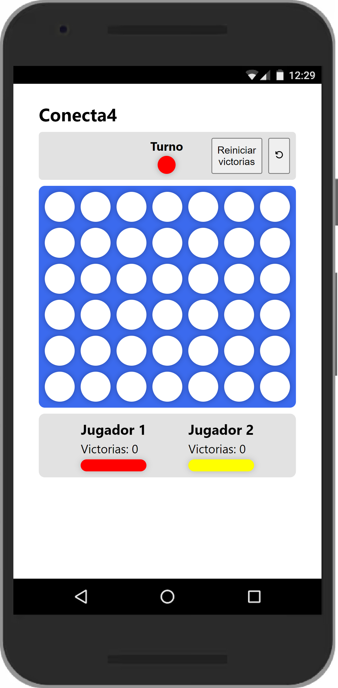

# Conecta 4 - **[Go to the App](https://connect4-steel.vercel.app/)**

This is a solution for the first challenge of Mouredev. **[Here is more information](https://github.com/mouredev/Monthly-App-Challenge-2022)**.

## Challenge Requirements

- 7x6 Board (7 on the "x" axis and 6 on the "y" axis).
- Red and yellow tokens. The first game is always started by the Red (the second the Yellow, the third the Red...).
- There is no need to implement a functionality that allows you to play against the App. It is assumed that two real people will play.
- On select a column place the token at the bottom.
- Save the number of games won by each player while the App is running.
- Two buttons to restart the game in progress and reset the win-loss counter.
- You can add all extra features you consider.
